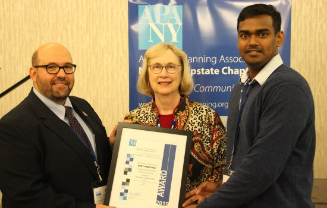

I was a part of The New York Upstate Chapter of the American Planning Association's Professional Awards Program held on October 3, 2019. It was my privilege to be engaging with luminaries from various professional backgrounds in the field of Planning and I am happy to receive Best Practice Award for the project ***Saratoga Springs Natural Resource Inventory***. 

These awards recognize outstanding contributions to the field of city, town, and regional
planning. The Professional Awards program recognized outstanding submissions in the areas of
comprehensive planning, implementation, public outreach, best practice, and distinguished
leadership.

> “We are thrilled to receive this award which recognizes the hard work conducted by our
> graduate students. We would like to thank our community partners for hosting our studio project
> and providing assistance and constructive feedback to our students. - [Marcia Kees](https://www.albany.edu/geographyplanning/faculty/marcia-o-kees), Adjunct Faculty and Studio Instructor" 

> “We congratulate the students who participated in this studio: [Karthik Soundara Rajan](https://www.linkedin.com/in/karthiksoundar/), Ian Barr, Brianna Francis and Jared Sayles. 
> The Professional Awards celebrate the hard and rewarding work that our colleagues do each
> day. - [Sean Maguire](https://www.linkedin.com/in/seanmaguireaicp/), AICP"

[Official Press Release](https://www.albany.edu/sites/default/files/2019-11/UAlbany%20MRP%20Award%202019%20Press%20Release%20.pdf)

[Official Announcement Page](https://www.albany.edu/geographyplanning/department-news)

### Saratoga Springs Poster: 

