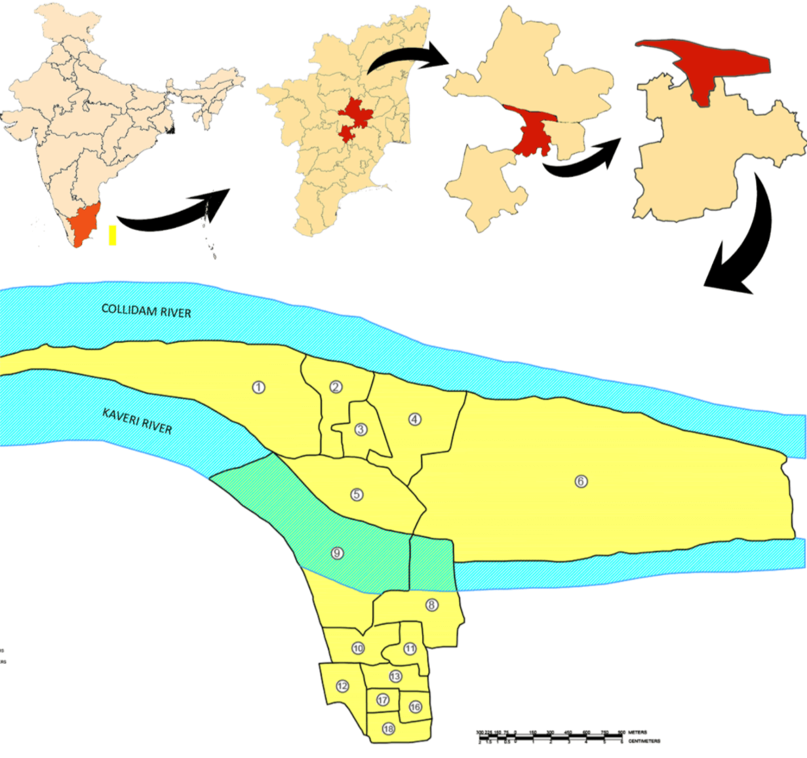
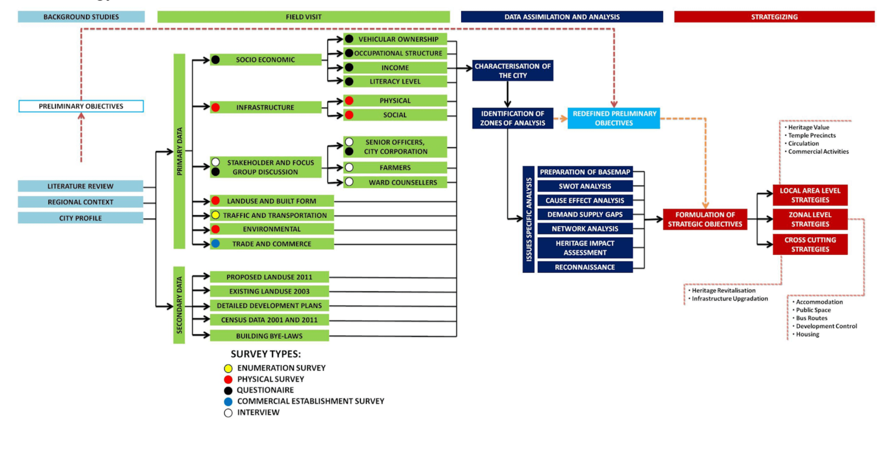
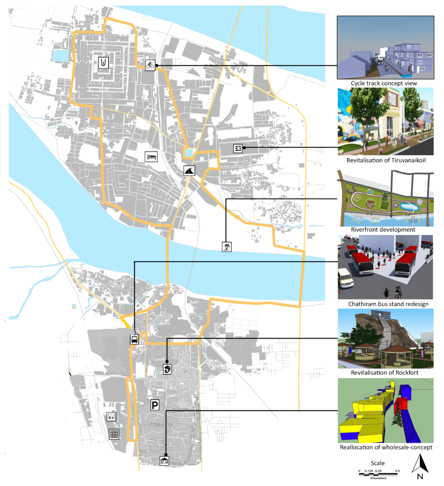
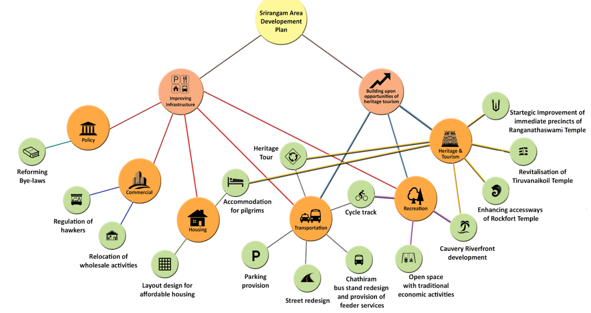

### Objective: 
To understand the characteristics of Srirangam, identify the possible areas of intervention, and guide the development process through area level strategic interventions.

### Methodology:

### Challenges:
- Loss of heritage value
- Deficient pilgrim facilities
- Infrastructure issues
- Neglected waterfront
- Unplanned residential pockets
- An unorganized dense commercial hub
- Improper transit station design
- Unkept heritage identity

### Outcome:
The Area Development Plan(ADP) for Srirangam was conducted through the extensive collection, assimilation, and analysis of primary and secondary data on the community. Two main aspects were recognized to address the issues in the community and develop a holistic ADP for the town, such as Improving the infrastructure and utilizing the potential of the existing heritage tourism. Within the two umbrella topics, a total of six possible areas of interventions were formulated, each with multiple detailed strategic objectives to guide the long term development process of the municipality.

### Broad areas of intervention
- Policy 
- Economic development
- Housing 
- Transportation
- Recreation
- Heritage and Tourism 

Under infrastructure development, the objectives firstly, to address the current issues, such as addressing the cluttered economic activity by the relocation of wholesale-hub and incorporate a cycle track to promote a non-motorized mode of transportation.

Secondly, to revive heritage and promote tourism by the revitalization of Thiruvanaikovil in the northern island and revitalization of Rockfort in the south.

Finally, to improve the living condition of the people by redesigning the transit station to make public transportation more efficient and increase the proper utilization of open space by riverfront development.

