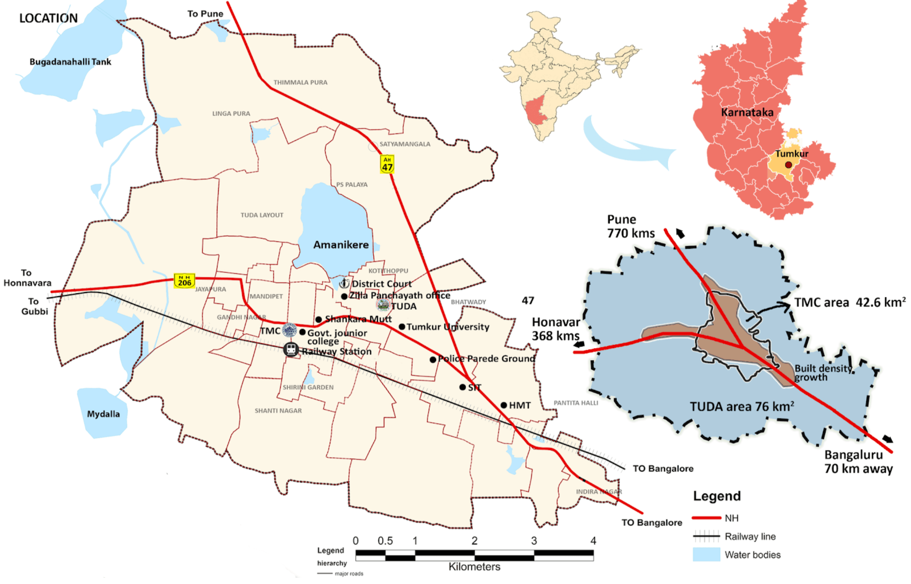
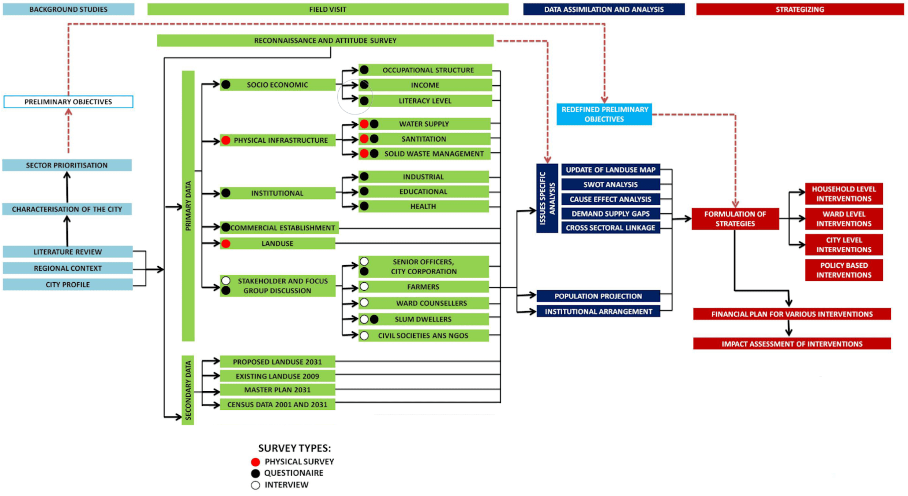
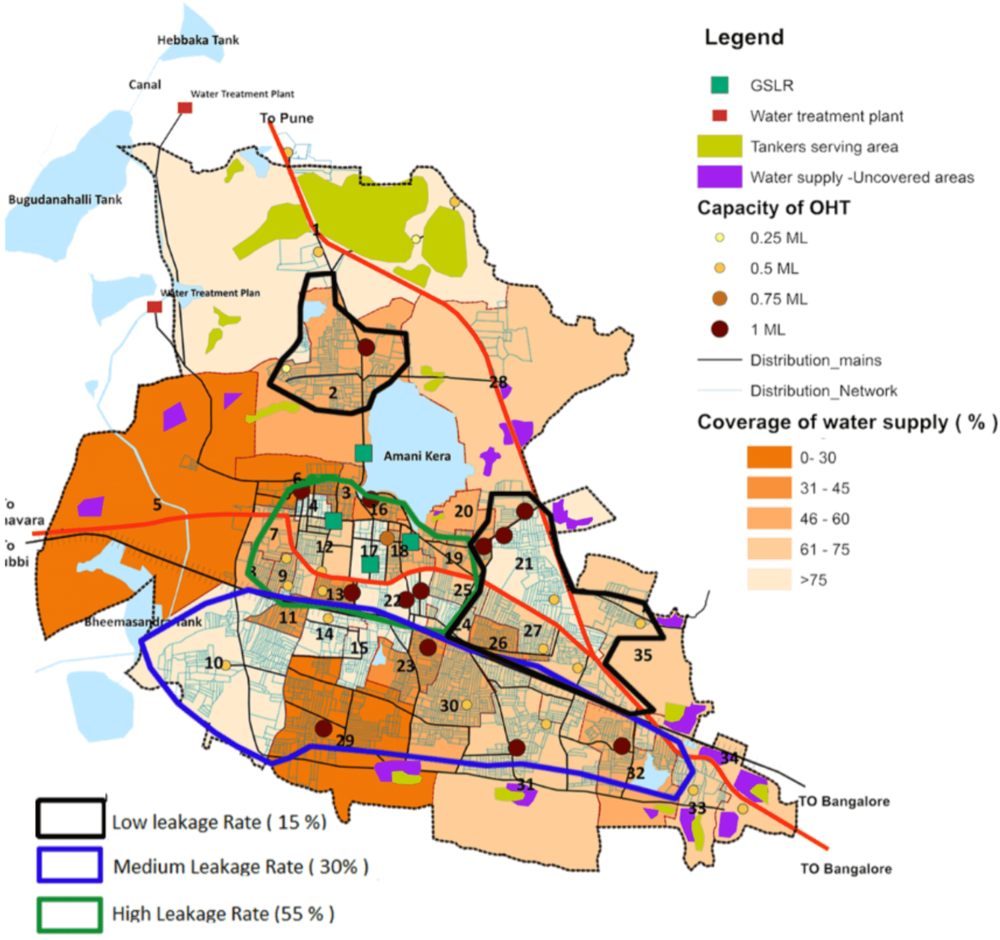
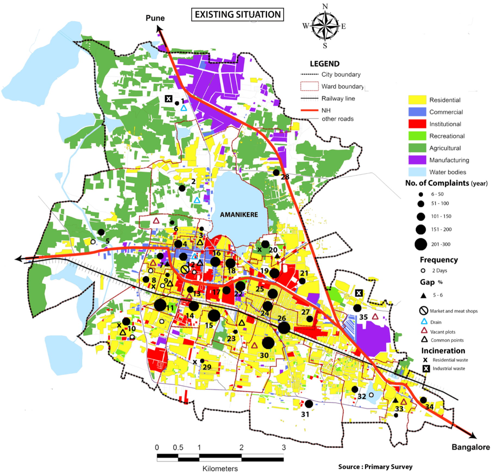
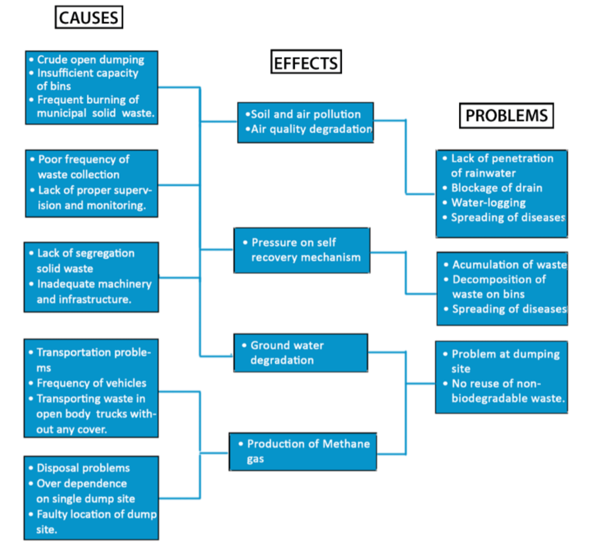
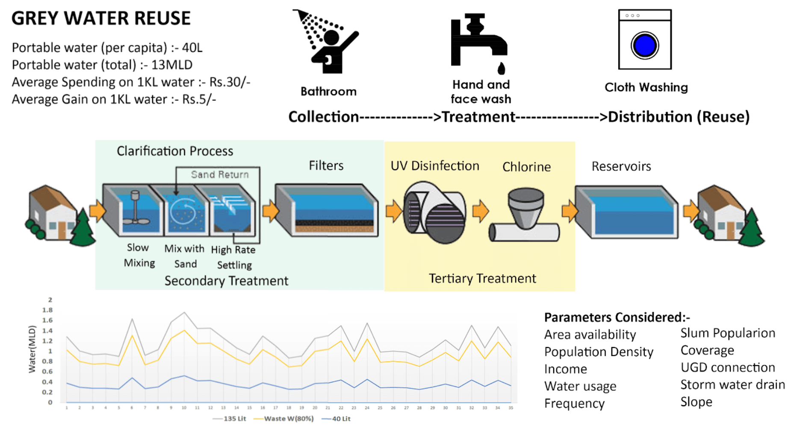
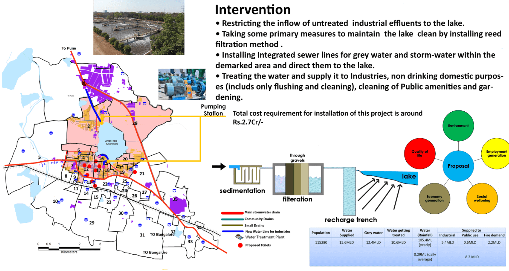
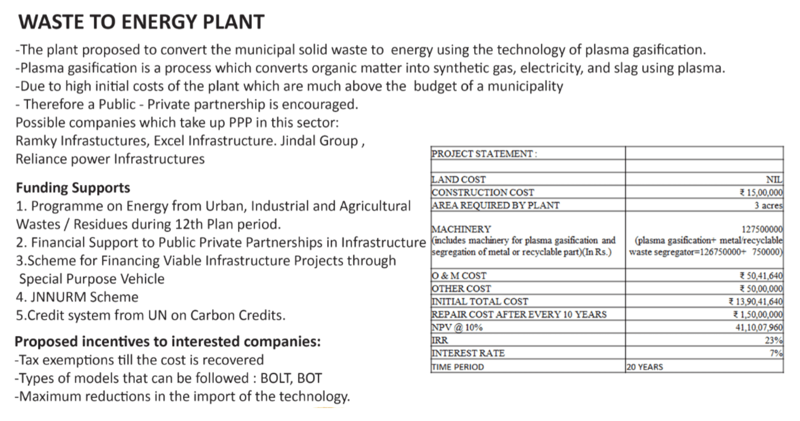
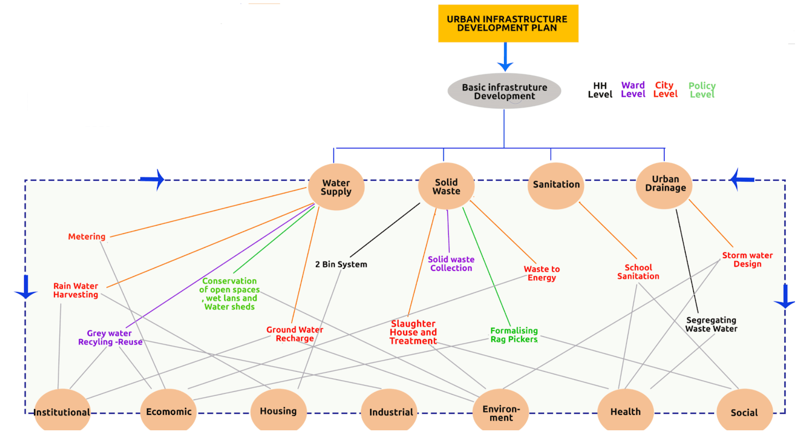

### Objective: 
To understand the city dynamics and existing statutory plan under which the city functions and create a sectoral plan focused on infrastructure to be a part of the comprehensive plan. 

### Methodology: 

The studio methodology was designed to work in four parts where the first part- Background Studies was intended to determine the objectives and desired outcomes of the study and acquire as much information as possible from online sources on the location and gather details on the scale and characteristics of the city and also to determine the nature of the study. Secondly, a thorough field visit to all the locations within the study area and gather both primary and secondary data on the city has been conducted. Thirdly, a thorough analysis of the acquired data to determine the issues, strengths, and challenges and finally strategizing the level of intervention and possible impacts on the community.

### Challenges and Issues:
Challenges and issues were determined specifically for each physical infrastructure, such as water supply, sanitation, solid waste management, and urban drainage system.

### Water supply
##### Problems in the Distribution System

- WTP in 1st stage water supply scheme not in working condition due to the damage in main pipe
- Leakages due to dilapidated conditions of GLSRs
- Problem in location of the current GLSRs
- Distribution network is not covered in the periphary wards of the city  
- Leakages is mostly seen in the old water scheme areas(core city area)

##### Solid waste management

##### Issues and Problems

### Outcome:
The Tumkur urban infrastructure development plan was developed by incorporating several strategic and systematic changes in the physical infrastructure, bureaucracy, and policies to attain a self-sustaining city that is inclusive, sustainable, holistic, and equitable. The primary objectives of understanding the current issues persisting in the urban infrastructure, determining the possible areas of intervention, and developing integrated strategies specific to each sector of the urban infrastructure were met and interventions were devised at the household level, ward level, city level, and policy level. 

### Key water supply development strategies:

Due to a serious, consistent decline in freshwater supply to the residents’ greywater reuse can substantiate the available freshwater supply

##### Funding 

The following flow chart describes the outcomes of the Tumkur Infrastructure development plan and their respective impact on the various elements of the communit

